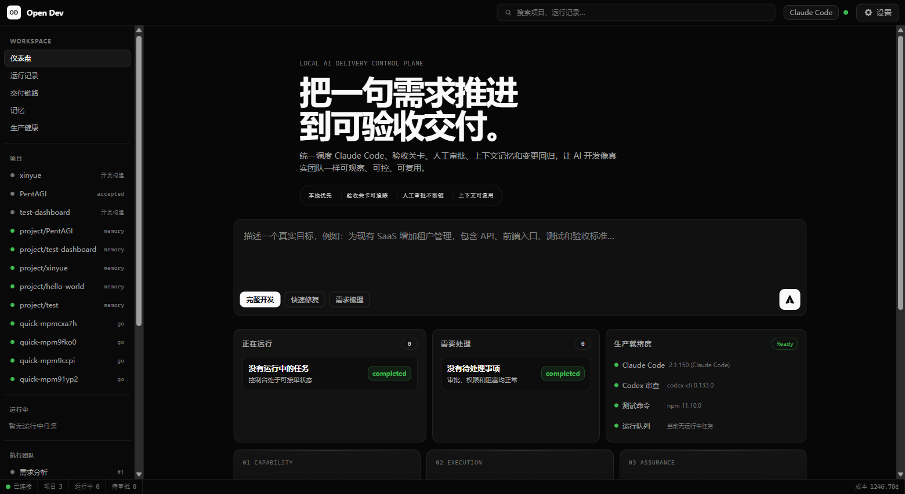
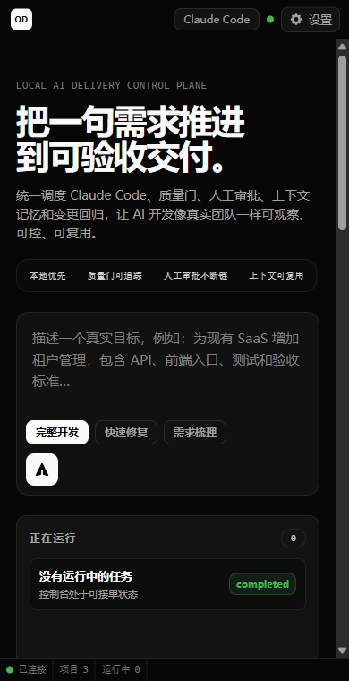

# Open Dev Control Plane

把一句需求推进到可验收交付的本地 AI 开发控制台。

Open Dev 是一个本地优先的 AI 软件交付工作台：你输入目标，它把需求、执行、审批、测试、安全、审查、部署和项目记忆组织成一条可观察、可治理、可复用的交付链路。它不是一个只会生成代码片段的 demo，而是面向真实工作流的控制面板。



## 为什么做这个

多数 AI 编程工具擅长“回答问题”或“写一段代码”，但真实交付需要更多东西：

- 需求要被压成可验收标准
- 实现过程要可观察、可暂停、可恢复
- 人工审批不能丢
- 测试、安全、审查和部署要形成质量闭环
- 项目经验要沉淀到下一次运行

Open Dev 的目标是把这些环节放进一个本地控制台，让 AI 开发像一个小型交付团队一样工作。

## 当前版本亮点

### 1. 专业级控制台首屏

新版首页聚焦真实工作流：正在运行、待处理事项、生产就绪度和交付能力矩阵一屏可见。用户第一眼能知道系统是否可接单、哪里被阻塞、下一步该处理什么。

### 2. 交付链路可观察

从需求分析、项目章程、产品策略、技术架构，到前后端开发、测试、安全审计、代码审查和部署上线，每个阶段都有明确职责和状态反馈。

### 3. 生产健康检查

控制台内置本地交付环境检查，聚合：

- Claude Code CLI 状态
- 审查工具状态
- 测试命令可用性
- 运行队列状态
- 待审批事项
- 成本追踪

### 4. 技能与 MCP 能力装配

技能商店把测试、安全、文档、性能、数据等能力变成可管理模块。MCP 服务器扩展工具能力，让系统不只是 prompt 拼接，而是可扩展的交付平台。

### 5. 本地优先，可控运行

控制台运行在本机，默认服务地址为 `http://127.0.0.1:3100`。项目状态、日志、记忆和质量门都能在本地追踪。

## 移动端视图



## 功能概览

| 能力 | 说明 |
|---|---|
| 对话式启动 | 用自然语言描述目标，系统识别意图并进入对应交付模式 |
| 项目工作区 | 查看项目阶段、运行记录、验收关卡、产物和上下文 |
| 运行监控 | 查看 Agent 运行、待审批事项和实时日志 |
| 交付链路 | 按阶段追踪从需求到部署的完整流程 |
| 生产健康 | 检查本地 CLI、测试、审批、运行队列和成本状态 |
| 记忆中心 | 管理项目事实、经验、事件和 Retrieval Pack |
| 技能商店 | 安装可复用能力，让任务执行时自动启用 |
| MCP 扩展 | 通过 Model Context Protocol 扩展工具边界 |

## 快速启动

### 环境要求

- Node.js 20+
- npm
- Claude Code CLI（推荐）

### 安装依赖

```bash
npm --prefix control-plane install
```

### 启动控制台

```bash
npm --prefix control-plane start
```

默认访问：

```text
http://127.0.0.1:3100
```

### 运行测试

```bash
npm --prefix control-plane test
```

## 项目结构

```text
control-plane/             本地控制台与 API 服务
companies/web-outsource/   交付流水线治理规则与操作手册
agents/                    Agent 角色资产
skills/                    Claude Code 技能资产
skeletons/                 可复用项目骨架
lessons/                   跨项目经验库
snippets/                  可复用代码片段
```

## 设计原则

Open Dev 遵循 ETHOS 治理原则：

- Evidence：所有决策要有可验证证据
- Trust but Verify：关键节点需要审查与验证
- Harm Minimization：只做必要修改，降低破坏面
- Ownership：每个阶段有明确责任归属
- Simplicity：简单优先，不为假设需求过度设计

## 适合谁

- 想把 Claude Code 接入真实项目流程的人
- 想搭建本地 AI 开发团队工作台的人
- 需要可观察、可审批、可恢复 AI 交付流程的开发者
- 正在探索“一人公司 OS”或 AI 外包流水线的人

## 版本

当前 GitHub Release：`v0.3.0`

这一版重点强化了控制台首屏、交付链路、生产健康检查和技能能力展示，让项目更接近一个可投入真实工作流的成熟产品。